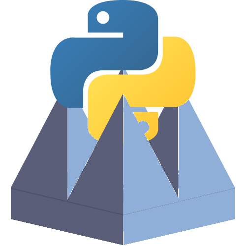

# PyChamber

PyChamber is an open-source application written with Qt to take anechoic chamber measurements. All measurements are saved as scikit-rf objects (or classes derived from them) which greatly simplifies post-processing.

* Documentation: <https://hrg-lab.github.io/pychamber>
* GitHub: <https://github.com/hrg-lab/pychamber>
* Free software: MIT
