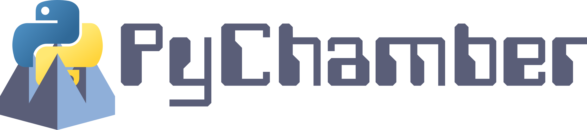
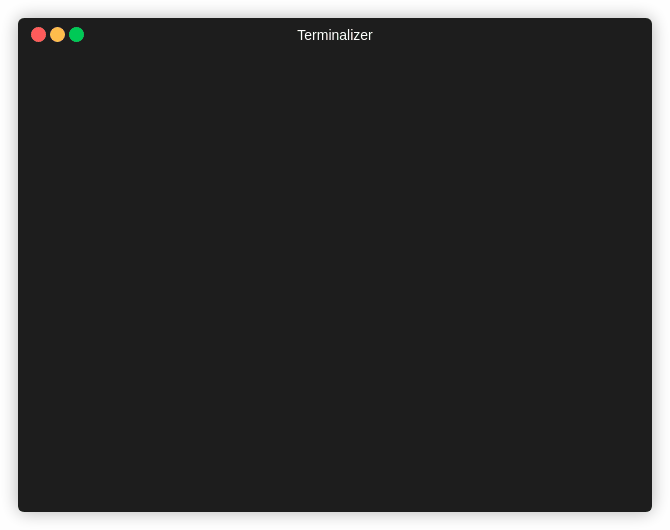

# pychamber

[](https://img.shields.io/github/v/release/pychamber/pychamber)
[](https://github.com/pychamber/pychamber/actions/workflows/main.yml?query=branch%3Amain)
[](https://codecov.io/gh/pychamber/pychamber)
[](https://img.shields.io/github/commit-activity/m/pychamber/pychamber)
[](https://img.shields.io/github/license/pychamber/pychamber)

<p align="center"></p>

Run anechoic chamber experiments from Python!

PyChamber is a Python program written with
[scikit-rf](https://github.com/scikit-rf/scikit-rf),
[pyqtgraph](https://github.com/pyqtgraph/pyqtgraph), and 
[Qt](https://doc.qt.io/qtforpython/) to provide a modern
and easy to use means of collecting anechoic chamber data. This was developed at
Penn State using the anechoic chamber there, and so currently only supports that
equipment. However, care has been taken to make PyChamber easily extensible with
a plugin architecture.

<p align="center">
    
</p>

Beyond the GUI, PyChamber provides a simple library that enables the scripting
of anechoic chamber measurements. This means if you were measure e.g. a phased
array, you could iterate over all array weightings of interest and take
measurements without ever having to touch any equipment. That interface is still
being tested and iterated on, however an example of that type of measurment
might look like:

```python
import pychamber
import skrf
from skrf.vi.vna import keysight
import numpy as np

analyzer = keysight.PNA('GPIB0::16::INSTR')
positioner = pychamber.positioner.connect("Diamond", "D6050", "COM3")
cal = pychamber.Calibration.load("ETSLindgren3164-10.pycal")

polarizations = [("Horizontal", 2, 1] # Name, S(a, b)
thetas = np.array(-180, 181, 1)
phis = np.array(-90, 91, 1)
freq = skrf.Frequency(start=1_000_000_000, stop=3_000_000_000, npoints=401, unit='Hz')
weights = np.array([
    # first array of weights
    # second array of weights
    ...
])

analyzer.ch1.frequency = freq
all_results = []

array = # However you setup your array

for weight in weights:
    array.set_weights(weight) # Example weight setting

    experiment = pychamber.Experiment(positioner, thetas, phis, polarizations, f)
    result = experiment.run()
    result.apply_calibration(cal)
    all_results.append(result)
```

`experiment.run()` will scan through all positions and polarizations and return
an `ExperimentResult`. While running, it will display status and progress as
exampled below.

<p align="center">
    
</p>

## Installing

Right now, pychamber can only be installed from source. To do this, download the
.whl file under relases (on the right) navigate to it in a terminal, and run

```bash
pip install ./<pychamber wheel>
```

---

Repository initiated with [fpgmaas/cookiecutter-poetry](https://github.com/fpgmaas/cookiecutter-poetry).
