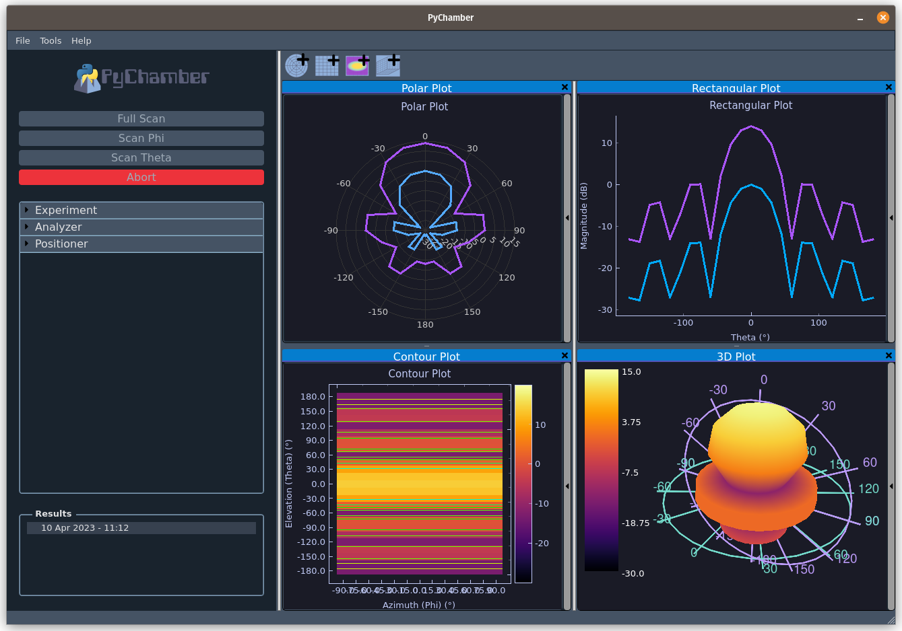
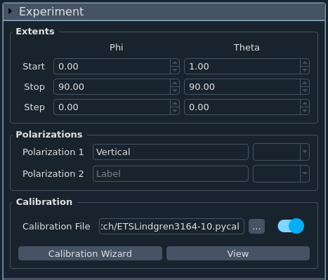
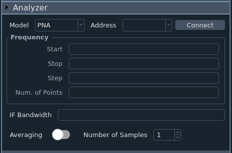
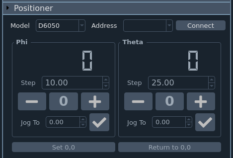
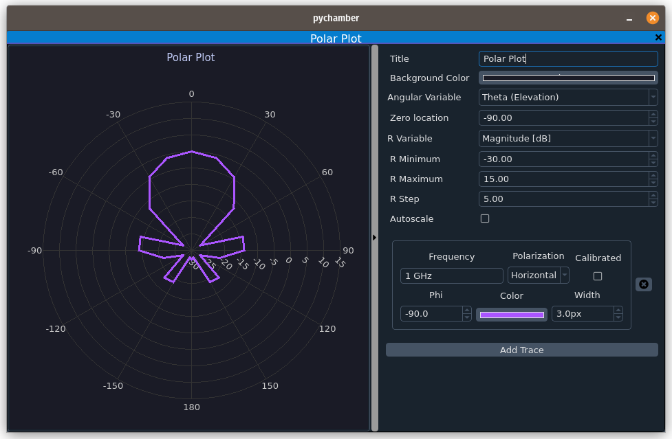
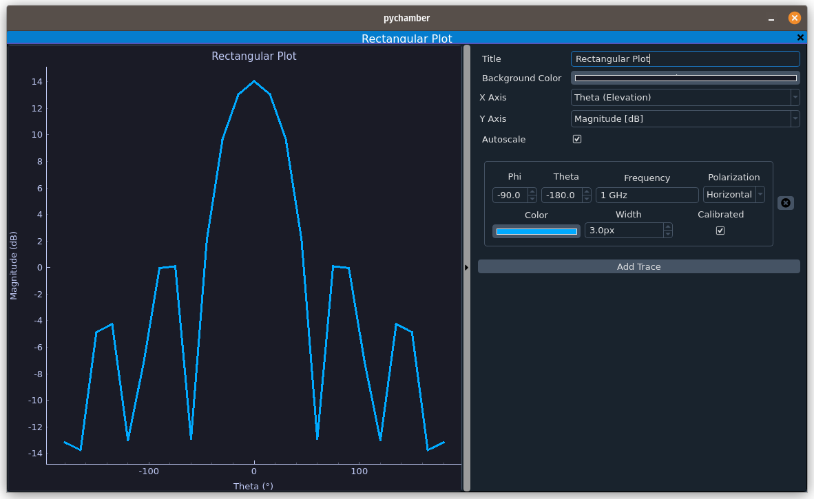
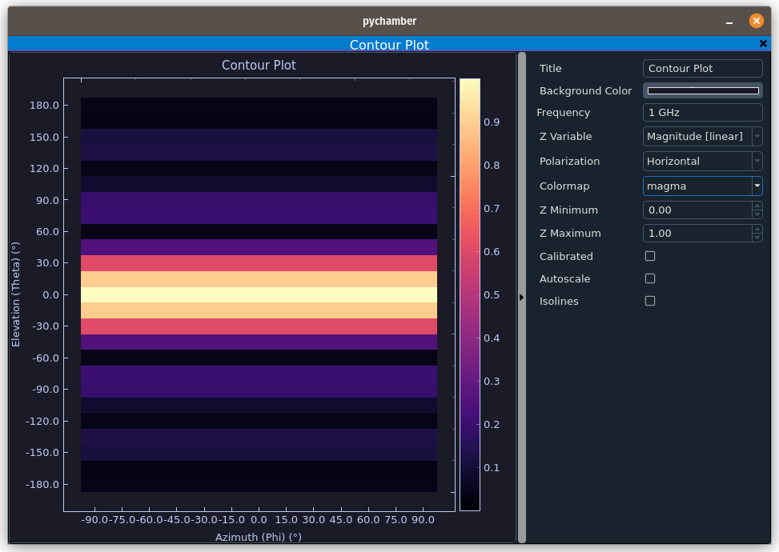
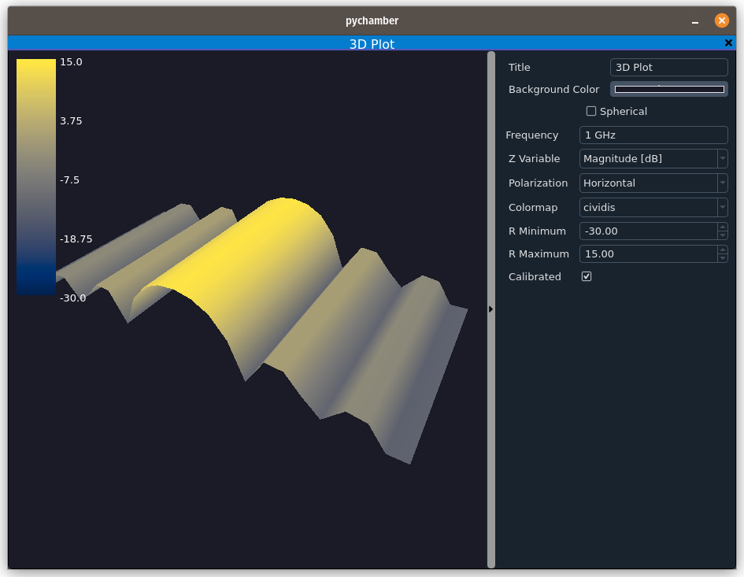
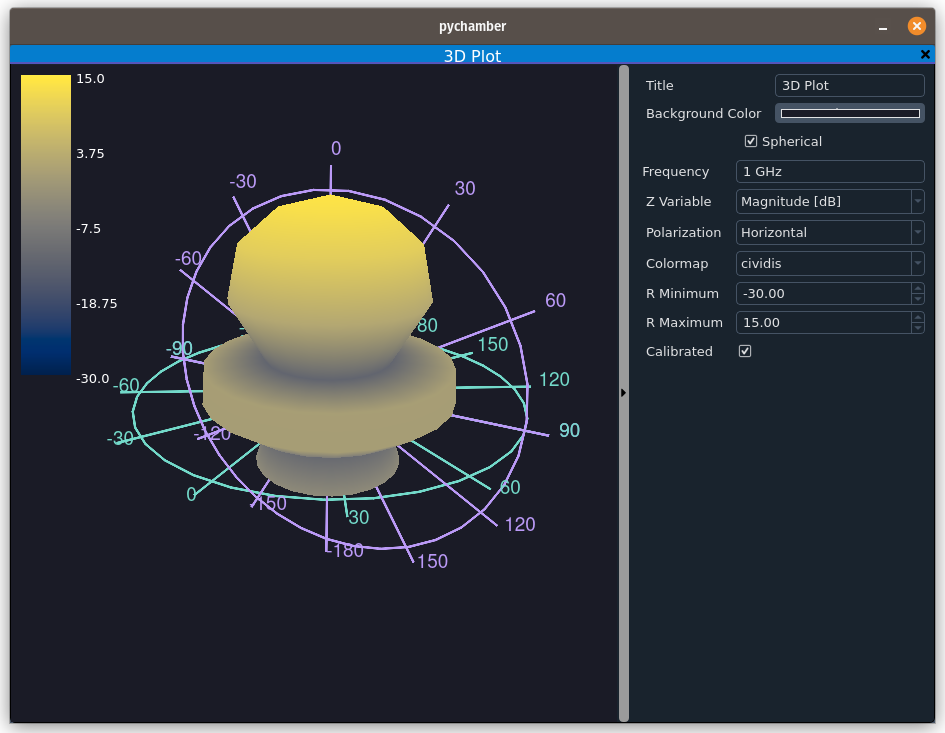

# Using PyChamber

    

## The interface

The PyChamber interface is split into two main sections. On the left, we have
all of the controls. These include experiment setup, analyzer controls,
experiment controls, and any additional controls that are part of loaded
plugins. At the top of this section are the buttons used to start and abort
measurements.

On the right side is where all of the plots live. You can view multiple plots
simultaneously, split them into a seperate window, and some plots allow you to
have multiple traces per plot. Each plot contains controls that are only for its
window. Plots are explained in further detail in [plots](#plots).

## Controls

The left side of the interface is where everything controlling measurements is
housed. At the top are the important buttons to start or abort the various types
of scans. Below these buttons are where all the other controls housed. Each
section can be expanded or collapsed by clicking the name.

The following sections are included by default:

- [Experiment](#experiment)
- [Analyzer](#analyzer)
- [Positioner](#positioner)

Plugins can add additional controls to this section if appropriate.

If any results have been taken or loaded, they will be displayed in a list at
the bottom. Clicking any of these items will set the "active" result set. Only
the active result can be shown in plots.

If a result is not saved, an exclamation point will be displayed next to it. You
can save it by clicking on it to make it active, then going to File->Save.

PyChamber will warn you if you try to exit with any unsaved data.

### Experiment

    

This section is where you setup the details of your experiment like the angular
extents, polarizations, and calibration. It is import to note that "Theta" is
defined as the angle from the +z-axis, and phi is the angle from the +x-axis
along the x-y plane.

Polarizations is where you set the name of each polarization (up to 2) and what
S parameter from the network analyzer that polarization corresponds to. These
dropdowns will not be active until you connect to an analyzer as connecting
informs PyChamber how many ports the analyzer has (and thus the available
measurable parameters)

Calibration is where you can load a previously saved calibration file, view that
calibration file, or run through a wizard to generate a new calibration file.

### Analyzer

    

This section is where you can connect to a network analyzer, and set properties
like the frequency, IF bandwidth, averaging, etc. More controls may become
available in later versions of PyChamber, and certain controls may become hidden
or shown based on the capabilities of the analyzer you connect to.

For frequency fields, you can type either a number like 1000000000000 for 1 GHz,
or you can just type '1 GHz' (withouth the quote marks). The command won't be
sent to the analyzer until you press enter on the keyboard or change what field
you're editing.

### Positioner

    

This section is where you can connect to and control the positioner, or antenna
mount. PyChamber should remember the last positioner for each different
positioner model and update the displays once connected. The large number
indicates the current position. The "Step" box controls how far the
corresponding axis will move each time a jog button is pressed. Clicking the "0"
button will return that axis to its zero position. You can also jog to a
specific position by entering the desired angle (in degrees), then clicking the
"Check" button.

The "Set 0,0" button is used to define the origin. This is used for example,
when you mount a new antenna under test and align it to the sense antenna. If
you don't take care while doing this, your measurements will look askew.

Finally, the "Return to 0,0" button will move both axes to their "0" position.

If the positioner you connect to has additional capabilities, more controls
related to those functions will be added to the bottom of this section.

## Plots

Thanks to [pyqtgraph](https://github.com/pyqtgraph/pyqtgraph), the plots are
extremely flexible. Think of each plot as living in its own window along with
its controls. By default, adding additional plots adds another tab, which you
can navigate to by clicking. The title of each tab is controlled by the "Title"
control for each plot. You can rearrange the plots however you wish by clicking
and dragging. Dragging to the side until you see a vertical blue bar will move
the split the window to the right or left. Dragging to the top or bottom until
you see a horizontal blue bar will split the window to the top or bottom. If
you already have multiple plots displayed in split windows, you can drag one on
top of another until you see a blue square in the middle to add the plot you're
dragging as a tab with the plot you drag it onto. Finally, if you double click
the title bar, the plot will split into its own seperate window. Closing the
window will add the plot back to the main window.

All plots have controls that are specific to the plot type. These are shown on
the right when a new plot is created, and can be hidden / shown by clicking the
long vertical grey button.

All but the 3D plot allow exporting to various formats by right clicking.

There are 4 types of plots available: Polar, Rectangular, Contour, and 3D.

### Polar Plots

    

- The "Angular Variable" dropdown controls what variable is on the angular axis.
- The "R Variable" dropdown controls what variable is the radial variable. Right
  now, you can only plot either linear or db magnitude.
- "Zero location" sets where 0 degrees is located. In the image above, 0 is set
  to -90, placing the 0 degree location at the top of the plot.
- "R Minimum", "R Maximum", and "R Step" all control the grid. If any value
  results in too many radial circles, the values will be updated automatically
  to something more sensible.

You can add up to four traces by clicking the "Add Trace" button. Each trace can
display uncalibrated / calibrated data, for a specific frequency, polarization,
and either theta or phi depending on what variable is chosen as the angular
variable. Traces can be deleted by clicking the X button on the right of each
trace.

### Rectangular Plots

    

The rectangular plots are more self explanatory. Currently, the available x-axis
variables are: Frequency, Theta, and Phi, and the available y-axis variables
are: Magnitude [linear/dB] and Phase [deg / deg unwrapped]

You can add up to two traces by clicking the "Add Trace" button. Each trace can
display uncalibrated / calibrated data, a specific polarization,
and some combination of theta, phi, frequency depending on what variable is
chosen as the x-axis. Traces can be deleted by clicking the X button on the
right of each trace.

Unlike polar plots, rectangular plots can be zoomed in or out, panned, etc using
the mouse.

### Contour Plots

    

Contour plots show 3 dimensional data with the third dimension show as a color
gradient. Right now, PyChamber only allows you to plot either linear or dB
magnitude. Other options include:

- "Frequency": what frequency to plot
- "Polarization": what polarization to plot
- "Colormap": what colormap to use to plot data. There are a lot. The most
  commonly used are at the top, and the default is the "cividis" colormap which
  was designed to be a perceptually uniform in color and grayscale and to be
  friendly to those with color vision defeciency.
- "Z Minimum" and "Z Maximum" change the scale. Values below the minimum are
  mapped to the minimum value, and values above the maximum are mapped to the
  maximum.
- "Calibrated" sets whether the displayed data is raw or calibrated (assuming
  calibrated data is available)
- "Isolines" sets whether or not to also display isovalue lines, which are lines
  along which values are equivalent (think of topographic maps where lines show
  altitude)

### 3D Plots

    
    

3D plots are, obviously, 3 dimensional plots. The first time you create a 3D
plot, PyChamber has to initiate its 3D graphics backend, so you may see the
application look like it restarts.

You can view data either as a cartesian plot, or a sphercal plot. In either
view, you can use the mouse to move around and zoom in or out. There are the
following controls:

- "Frequency": what frequency to plot
- "Polarization": what polarization to plot
- "Colormap": what colormap to use to plot data. There are a lot. The most
  commonly used are at the top, and the default is the "cividis" colormap which
  was designed to be a perceptually uniform in color and grayscale and to be
  friendly to those with color vision defeciency.
- "R Minimum" and "R Maximum" change the scale. Values below the minimum are
  mapped to the minimum value, and values above the maximum are mapped to the
  maximum.
- "Calibrated" sets whether the displayed data is raw or calibrated (assuming
  calibrated data is available)
