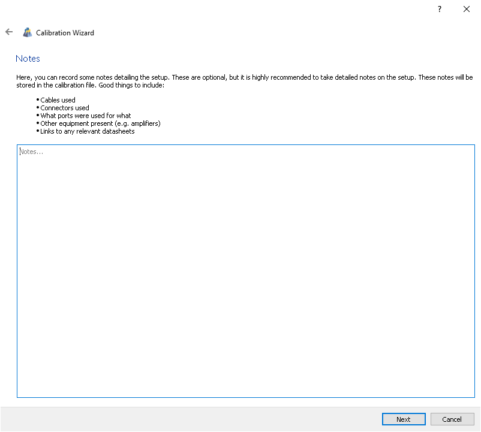
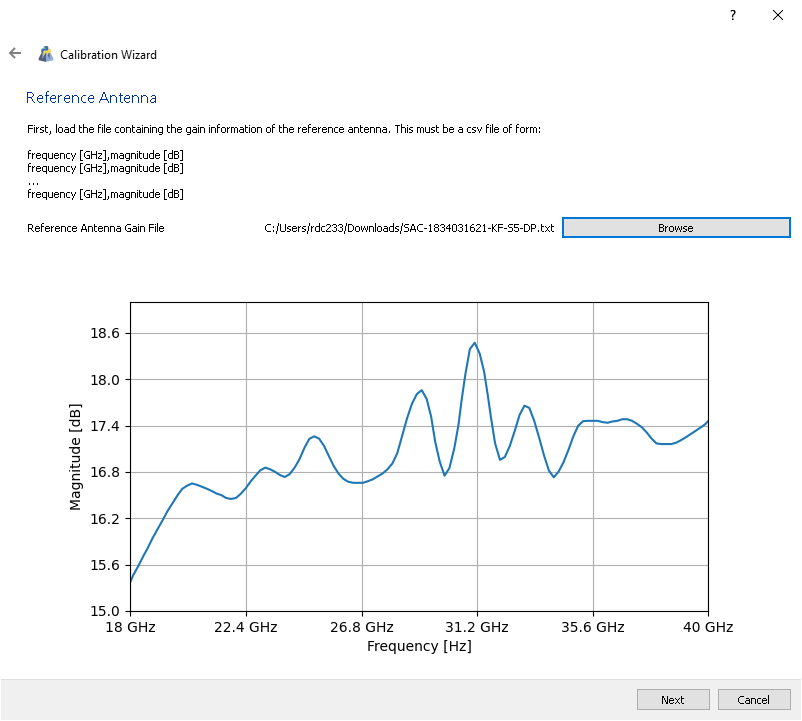
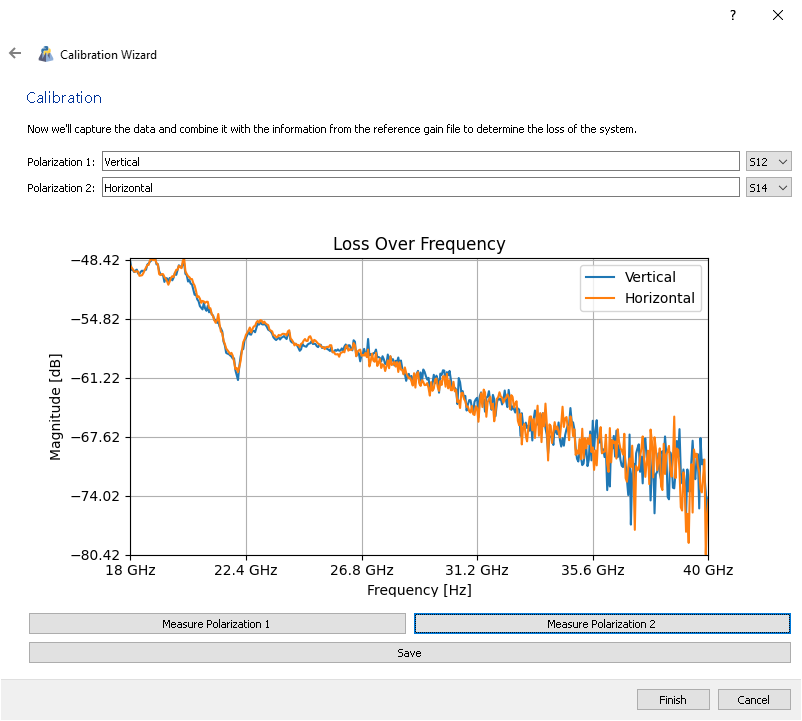

Calibration is the process by which we characterize the gains and losses of our
setup such that we can get realized gain from our measurements. This is done in
PyChamber by measuring an antenna with **known** characteristics.

PyChamber helps you through this process with the Calibration Wizard, accessible
by clicking the corresponding button in the Calibration plugin.

!!! info
    The wizard is only available if you are connected to an analyzer!

The wizard should explain each step, but we'll go into extra detail of certian
pages here if you have questions.

## Notes

This is where you can notes on your calibration. The more detailed your notes,
the more repeatable your experiments! These notes will be saved as part of the calibration.

## Reference

This is where you upload a file containing known gain values of your reference
antenna. This should be a .csv file with no headers in the format:

Frequency [GHz], Gain [dB]
Frequency [GHz], Gain [dB]
Frequency [GHz], Gain [dB]
...

If you don't have such a file, you can generate one from a manufacturer's
datasheet using something like [this online
tool](https://automeris.io/WebPlotDigitizer/).

Once it's loaded, the data should be plotted for you to verify. If everything
looks okay, click next.

## Measure

This is where you do the actual calibration. You first apply a label to each
polarization (if you're using both) and assign the measurement parameter. You
will measure each polarization individually and the loss will be plotted.

You can see in the image that the loss is very large and noisy at higher
frequencies in this case. You must ensure your reference antenna is above the
noise floor or measurement results will be nonsense.

Then you can save it to a file (again, this will be a pickled binary file).

You can view a calibration any time by loading it, then clicking "View
Calibration" in the Calibration plugin.
