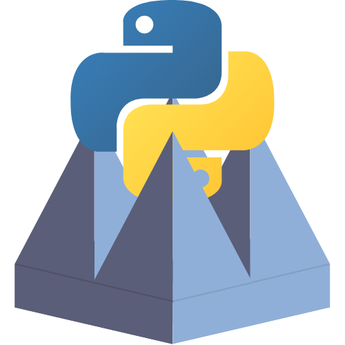

# PyChamber

</img>

PyChamber is an open-source application written with Qt to take anechoic
chamber measurements. All measurements are saved as scikit-rf objects (or
classes derived from them) which greatly simplifies post-processing.

## Table of Contents

- [Overview](./): This page
- [Installation](./installation.md): Ways to install PyChamber
- [The Interface](./the_interface.md): Explains the GUI
- [Taking a Measurement](./taking_a_measurement.md): The process of setting up
  and taking a measurement
- [Calibration](./calibration.md): How to perform a calibration
- [Interacting with Data in Python](./interact_with_data.md): How to load data
  into Python and use it
- [API Reference](./reference/): Documentation of the Python API
- [Contributing](./contributing.md): How to help with the development of
  PyChamber
- [Changelog](./changelog.md): Summaries of each update of PyChamber
