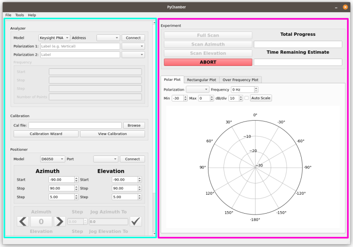

PyChamber consists of two areas: the plugin panel (in cyan), and the main area
(in fuschia).

The plugin panel is where most of the experiment setup is done. Additionally,
user-installed plugins can be added to this panel to provide additional functionality.

By default, PyChamber has the following plugins loaded to the plugin panel:

- Analyzer
- Calibration
- Positioner

Plugins will become enabled/disabled through use. For example, the analyzer
functions will only be available once you've connected to an analyzer.

At the bottom is a status bar which can show some helpful status messages.

## Start the Measurement

Once everything is in place, you can start your measurement. This will disable
the analyzer and positioner plugins to prevent any issues trying to
simultaneously control something while the experiment is taking data. The time
remaining estimate will start off with a very innacurate estimate, but each time
data is captured the average time at each position is updated and you should get
a fairly accurate estimate pretty quickly. If you're running a full scan
(azimuth and elevation), a cut-progress bar will appear showing the progress of
the current cut plane.

Clicking abort will stop all measurements and halt the positioner.

## Monitoring Progress

Any plots will be updated live as data is taken. Feel free to change the plot
settings while the measurement is being taken. Eventually, the plan is to add
more supported plots (including 3D!).

You can either set the scale manually or have the plot autoscale as measurements
are taken, by checking the box.

## Saving data

Once you're done with your measurement, you can save it to disk using the file
menu. This is even true if you have to abort mid-measurement. You will be able
to save what you've got.

Data is saved in a binary format by pickling to reduce size. You can load it
later in a python script or in PyChamber. More information on using data in a
script can be found in [Interacting with Data in
Python](./interact_with_data.md)
