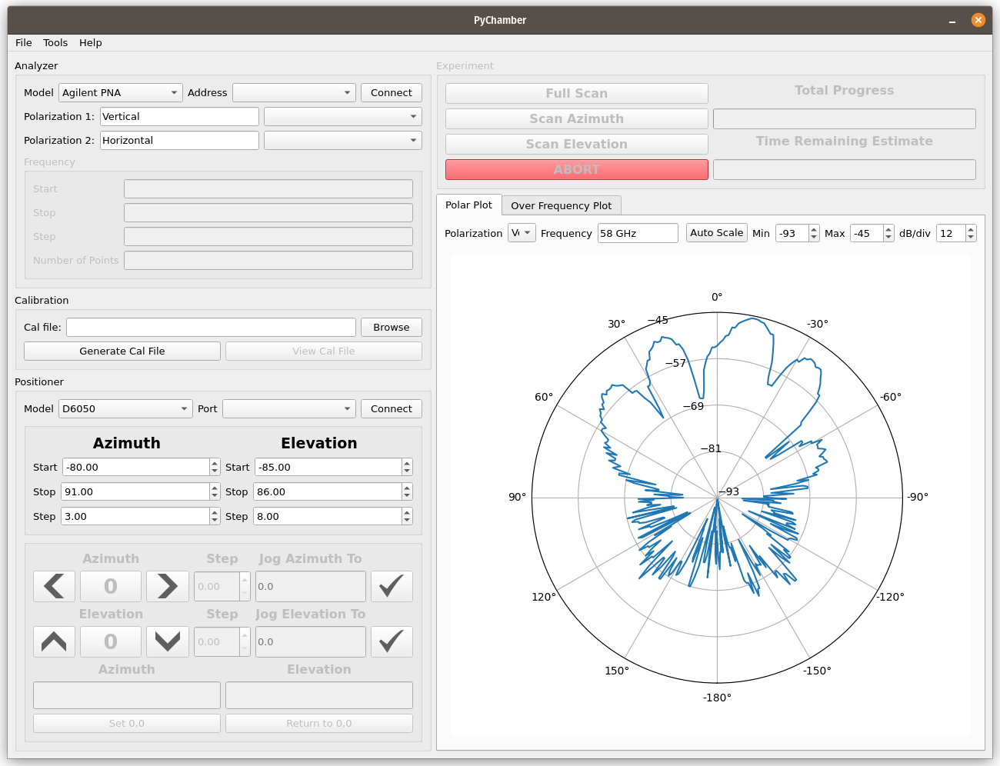

# Main Window

Above is a screenshot of the main window of PyChamber. Each GUI element is
grouped by function. For example, the "Analyzer" box is where all interactions
with the network analyzer take place.

The analyzer and positioner boxes will not allow you to interact with them until
you've established a connection to the analyzer / positioner. The experiment box
will not be enabled until you connect to **both** the analyzer and a positioner.

## Analyzer

The analyzer box is where you will connect to the analyzer, assign polarizations
to specific S-parameters, and assign your frequency settings. Any more complex
settings will have to be done on the analyzer, e.g. IF bandwidth, port power
settings, etc.

The "Model" dropdown is populated with the models supported by scikit-rf's VI
module. If you don't see your analyzer listed, consider contributing to
scikit-rf with an implementation!

The "Address" dropdown allows you to select the VISA address where your
instrument is located. If you do not see your instrument's address, you may not
have the correct VISA installation installed or you need to select the proper
VISA library that supports your instrument (more detail below).

Clicking "Connect" will attempt to connect to the analyzer and if successful,
populate the box with the current analyzer frequency settings.

### Polarization

You can assign specific S-parameters to specific polarizations. The labels are
provided for convenience and are what each measurement will be labeled in the
final dataset. The labels can be anything you choose. The dropdown box is where
you assign a specific measurement to each polarization. For example, if your
vertical polarization is S21 and your horizontal polarization is S41, you would
choose S21 and S41 in each dropdown appropriately.

The available S-paramenters are dependent on your specific analyzer.

### Frequency

Here you can change the frequency settings of your analyzer. You can enter
frequencies as you would imagine, e.g. "650 MHz", "10GHz", "10000000", etc.

!!! warning "Important!"
    You must press enter to finalize changes and apply them to your analyzer.

## Calibration

TODO :)

## Positioner

This is where you choose your positioner model, connect to positioners, set the
range and step size for your experiments, jog the positioner, etc.

Currently, the only  positioner supported is the Diamond Engineering D6050.
Please consider contributing to support more positioners!

The port dropdown is the USB port the positioner is connected to. Unlike the
analyzer, the positioner does not store information about it's location
internally. This means if you quit the program you'll have to redefine the 0,0
position.

Once connected, you can jog the positioner using the appropriate buttons. The 0
buttons will return the positioner to its defined 0 position. The step size
defines how much the positioner will move with each button press, and the "Jog
To" field allows you to jog the positioner to a specific location.

!!! warning "Important!"
    You must press the check button to jog. This is intentional to prevent the
    accidental movement of the positioner.

### Defining the origin

To define the 0,0 point of the positioner, you must jog it to the position you
want to define as the origin (typically boresight). Then click "Set 0,0" in the
bottom left.

## Running an Experiment

After you've connected to the analyzer and positioner, set up your frequency
settings, set up your positioner settings, and any other set up you need,
running an experiment is as simple as clicking the appropriate button. This will
move the positioner to the minimum azimuth and elevation and begin taking
measurements.

The time remaining is simply an estimate based on the time each move and measure
has taken.

Clicking "ABORT" will attempt to stop the positioner but will only abort after a
movement is completed.

## Results

The "Polar Plot" and "Over Frequency Plot" are updated as measurements are
taken, and you can view different data as it's being taken. Similarly to the
analyzer frequency, the polar plot frequency can be entered as you would expect,
e.g. "450 MHz", "2.45GHz", etc.

Once measurements have started, the polarization drop downs will be populated
with the labels you specified.

## Menus

### File menu

"Save" and "Load" do what you would expect. Loading the data will update the
polar and over frequency plots to allow to you explore the data.

"Settings" will bring up the settings window where you can change which VISA
implementation is used to communicate with the analyzer, and the Python Console
Theme is simply the color scheme of the integrated Python console.

### Tools

The "Tools" menu contains helpful utilites, currently only an integrated Python
console. If an experiment has been run or data loaded, it will be available in
the console as the variable `measurements`.

The Python console is provided to allow the user to perform mathematical
manipulation of the data.

More tools will likely be added as PyChamber matures.

### Help

Here you can see information about PyChamber, submit a bug report or view / save
the program logs which can be helpful when submitting a bug report.
